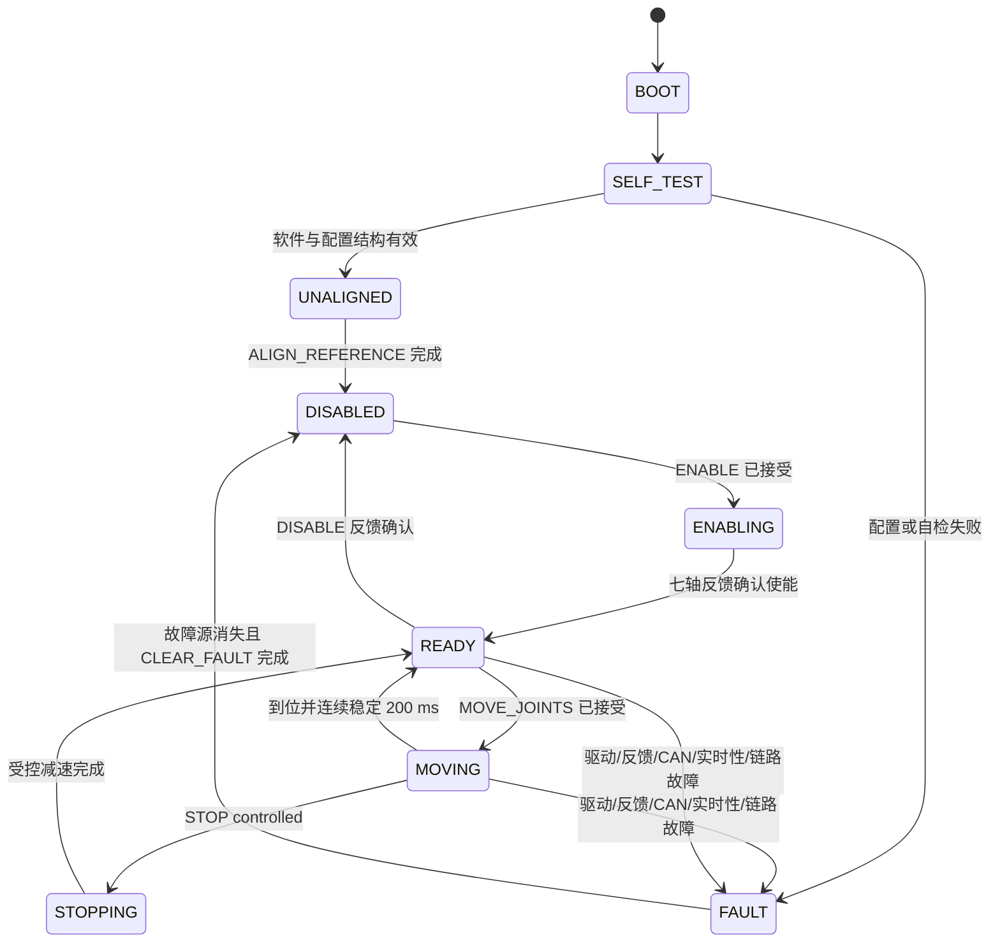

# 状态机与命令生命周期回放

## 正式七轴状态



生产参数尚未逐轴验证时，固件可以查询、模拟和完成主机测试，但 `SELF_TEST` 不会放行真实七轴使能。

## 典型动作回放

```text
PC                  STM32                 七电机
REQ MOVE_JOINTS --> 原子校验
<-- ACK accepted    固定队列接管
                    同周期排入 J1..J7 -->
<-- TEL ...         读取一致性反馈快照
<-- EVT ...         状态变化
<-- DONE COMPLETED  误差/速度/新鲜度连续满足 settle_ms
```

STOP 使用独立高优先级槽。受控停止有可用反馈时按共同减速时长执行并保持使能；反馈失效或控制帧无法原子入队时升级为快速停止和全轴失能。

## 会话重建

```text
USB 断开或 1,000 ms 超时
  -> 活动请求 DONE FAILED/CANCELLED
  -> 全部已使能电机失能
  -> LINK_TIMEOUT 事件
  -> 上位机重新连接并 HELLO
  -> 查询 GET_INFO/GET_CONFIG/GET_STATE
  -> boot_id 变化时重新 ALIGN_REFERENCE
```
