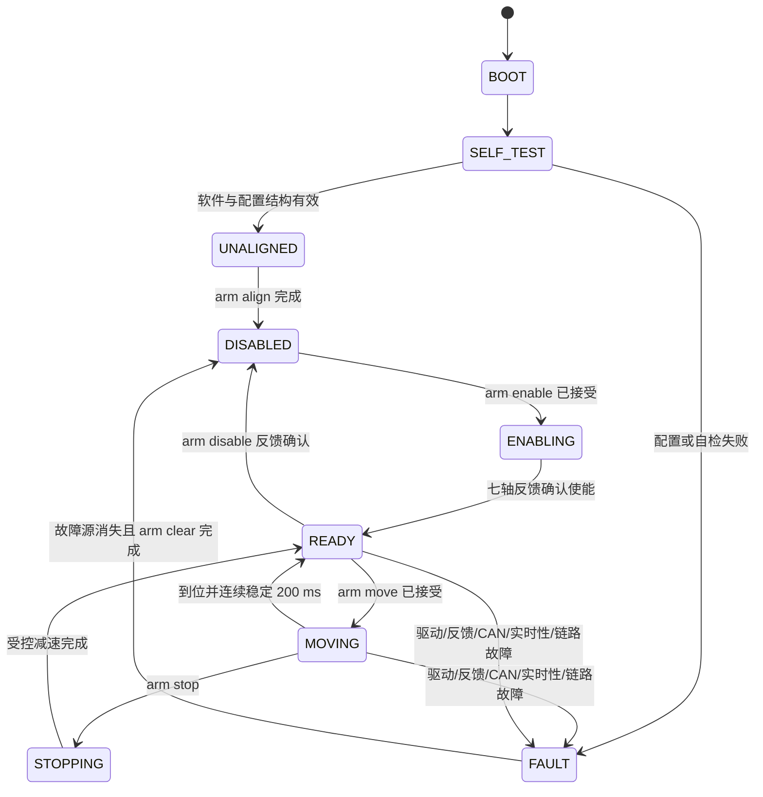

# 状态机与命令生命周期回放

本文描述当前 `aethor-text-v1` 正式入口。旧 `REQ/RSP/ACK/ERR/EVT/TEL` 名称只属于 `aethor-arm-ascii-v1` 回归资产。

## 正式七轴状态



生产参数尚未逐轴验证时，固件可以查询、模拟并完成主机测试，但 `SELF_TEST` 不会放行真实七轴使能。台架 Profile 使用显式电机子集和独立的 `bench` 命令，不代表正式七轴状态机已经通过机械验收。

## 查询生命周期

```text
上位机                         固件
7 show state  ---------------> 解析并读取一致性快照
               <-------------- ok 7 show state state=ready ...
```

- 查询使用匹配请求编号的 `ok` 或 `error` 结束。
- 省略请求编号时固件使用编号 `0`，便于人工串口输入；编号 `0` 不进入近期结果重放。
- `show` 和 `data` 都是只读输出，但遥测到达不替代通信保活。

## 台架动作生命周期

```text
上位机                         固件                         所选电机
13 bench jog ...  -----------> 校验 Profile、列表、位移和速度
               <-------------- ok 13 bench jog accepted=1
                               发送固定绝对 CAN 目标批次 --->
ping              -----------> 刷新通信看门狗
               <-------------- ok <id> ping ...
                               未到位：复位批次索引并重发 -->
                               已到位：完成动作
               <-------------- done 13 bench jog result=completed ...
```

- `bench jog` 只由上位机发送一次。收到 `accepted=1` 后，上位机保留请求编号并等待匹配的 `done`。
- 固件在动作开始时根据反馈计算一次固定绝对目标；未到位时只复位 CAN 批次读取索引，不重新解释串口命令、不改变目标。
- 上位机不能通过不断分配新请求编号来重复提交同一动作，否则会形成多个业务请求。
- 已接受动作无论成功、停止、取消或失败，都通过 `done ... result=completed/stopped/cancelled/failed` 报告终态；校验或入队失败在动作开始前返回 `error`。

## 请求重放

```text
13 bench jog ...  -----------> 首次受理并执行
               <-------------- ok 13 ... accepted=1
               <-------------- done 13 ... result=completed

13 bench jog ...  -----------> 相同非零编号、相同正文
               <-------------- 缓存结果；不再次驱动电机

13 bench jog ...不同正文 -----> 编号冲突
               <-------------- error 13 ... code=request_conflict
```

近期结果容量为 32 项，保留 60 秒。上位机应把重放作为链路恢复手段，而不是周期运动命令；人工编号 `0` 不提供重放保护。

## 停止与失能

- `arm stop` 使用独立高优先级槽。反馈有效时按共同减速时长执行并保持使能；反馈失效或控制帧无法原子入队时升级为快速停止和全轴失能。
- 台架异常清理依次发送 `bench stop <motors>` 和 `bench disable <motors>`，并等待各自终态；脚本退出路径只做尽力清理，不能替代物理断电能力。
- 驱动故障、反馈超时、CAN Bus-Off、传输故障和通信看门狗均可使活动动作以失败或取消终态结束。

## 保活与连接重建

```text
任一电机使能或存在活动运动
  -> 上位机每 250 ms 或更快发送有效 ping
  -> 1000 ms 无有效请求
  -> 固件停止并失能
  -> event ... link_timeout elapsed_ms=1000 action=stop_disable
  -> 上位机重新连接并发送 hello
  -> stream off
  -> show info/config/state/motors/diag
  -> boot 改变时丢弃旧请求与旧目标
```

全部电机失能且无运动时，通信看门狗不触发停止/失能；因此只读手工调试不需要周期重复发送指令。重新连接后必须先确认设备身份、Profile、`boot`、电机状态和故障掩码，再开放动作；正式机械臂 Profile 还需重新确认参考位。
