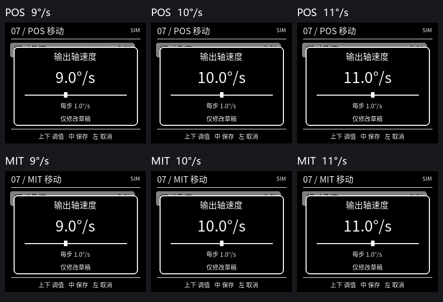

# Astra 速度弹窗修正版

POS、MIT移动速度默认10°/s居中，增减1°/s时滑块在低速区明显移动，数字同步更新。实际步进和速度范围不变。实现及边界见 [修正说明](../../docs/debug-ui/speed-popup-centered-20260915.md)，六帧真实LVGL模拟对照见下图。

28项完整检查通过，四目标Keil编译均为0错误、0警告。各LCD目标RAM仍为174464字节，Code+RO比B2增加216字节；LVGL固定池仍为32 KiB，采样占用10160字节。具体源码摘要、HEX校验值及验证记录见 [verification.json](verification.json)。其中软件验证与模拟图不代替实机验收。

- [LCD-MIT.hex](LCD-MIT.hex)：包含POS与MIT本地入口，沿用当前电机7配置。
- [LCD-POS.hex](LCD-POS.hex)：本地POS入口。
- [LCD-ReadOnly.hex](LCD-ReadOnly.hex)：只读显示。

前一版源码保留在 `archive/lvgl-astra-ui-b2`，原 [B2固件目录](../2026-09-14-astra-popup-preview/README.md) 和其他旧版本均未改动。`verification.json`记录编译时的软件验证状态；本次烧录记录单独保存在本机 `D:/download/TCG/output/astra-speed-flash-20260915`。
